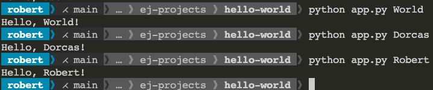
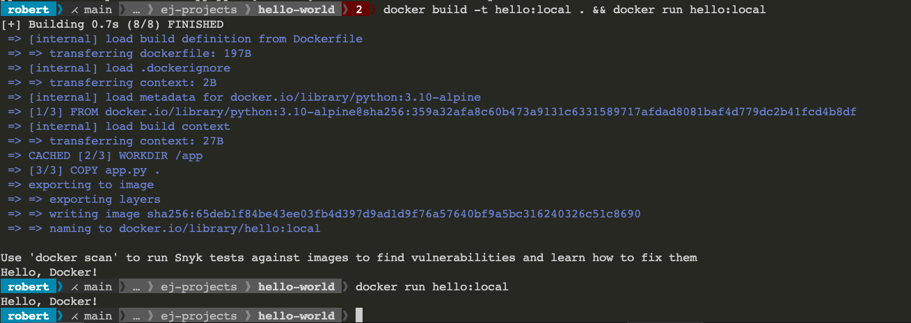

# hello-world


## Writing a app that prints the first argument ($25)

### Installation

If using docker a local python runtime is not required.  If you wish to run python locally you can install it here:

https://www.python.org/downloads/

### Command

```bash
python app.py Ethan
```

### Useful google search links

https://www.google.com/search?q=get+arguments+python
https://www.google.com/search?q=get+first+argument+python
https://www.google.com/search?q=get+first+item+in+list+python

### Desired output



## Extra Credit: Running your app in a python container ($25)

### Why should you use Docker in lieu of local runtimes:

Reading:

* https://dev.to/npentrel/docker-containers-vs-vms-257i
* https://dev.to/amoniacou/what-is-docker-why-is-it-important-and-necessary-for-developers-part-i-39e5

TL;DR video overview (not super detailed):

* https://youtu.be/Gjnup-PuquQ

Super in-depth high level overview:

* https://youtu.be/zJ6WbK9zFpI

### Installation

https://www.docker.com/get-started

**Note:** No sign-up is required.

### Commands

#### Build container using the supplied Dockerfile:

```bash
docker build -t hello:local .
```

#### Run container

```bash
docker run --rm hello:local
```

### Desired output


